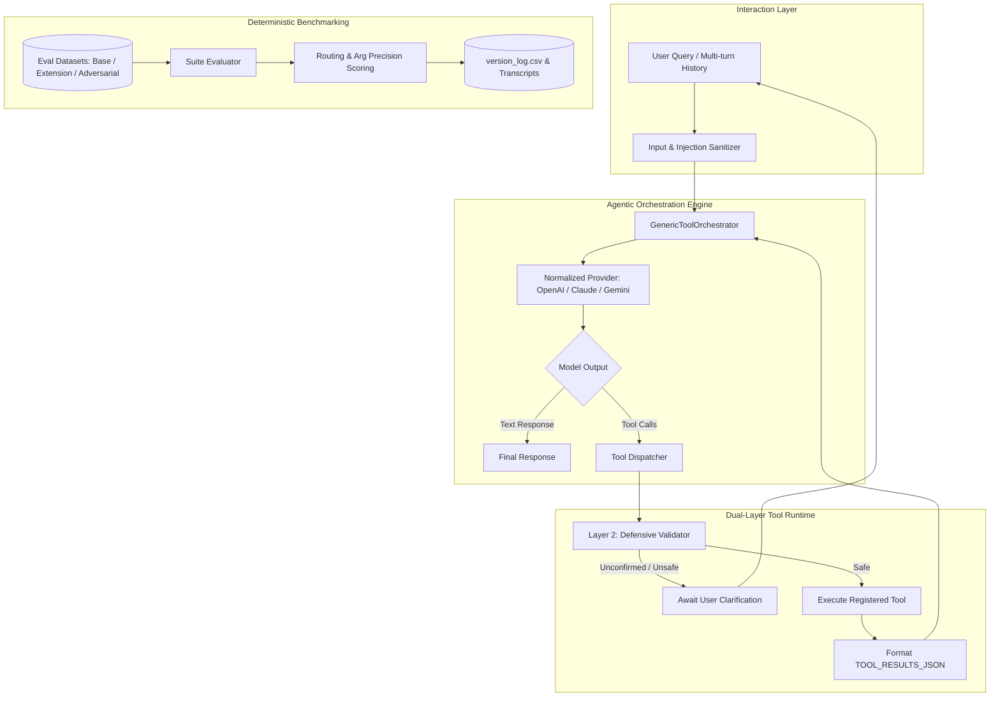

# Agentic Tool Evaluation Harness Skill

## Scope and routing

Owns tool-call orchestration and deterministic evaluation of tool selection, arguments, call counts, and multi-turn behavior. It does not own general answer-quality benchmarks or the shared security policy model. Use [AI Evaluation](../ai_evaluation_skill/SKILL.md) for answer/RAG scoring and [Responsible Agent Guardrails](../responsible_agent_guardrails_skill/SKILL.md) for cross-agent input/output, egress, and HITL policy.

## Applying this skill

Apply only the phases relevant to the requested change. Inspect the target repository and its tests first; treat provider, dependency, and metric settings below as defaults to verify. Prefer mocks/local tests, avoid unnecessary installs or external calls, and never expose secret values.

## 1. Skill Name & Description

- **Skill Name:** `agentic-tool-eval-harness`
- **Trigger Condition:** Kích hoạt khi Agent cần xây dựng, kiểm thử, đánh giá (evaluation benchmark), gỡ lỗi (debugging), tối ưu hóa prompt/tool schema (prompt iteration), hoặc triển khai hệ thống AI Agent có khả năng gọi công cụ (Tool Calling / Function Calling).
- **Recognition Keywords:** `tool calling`, `function calling`, `agent evaluation`, `prompt engineering`, `multi-turn eval`, `tool routing`, `schema validation`, `guardrails`, `red-teaming`, `adversarial testing`, `benchmark harness`, `system prompt iteration`, `dual-layer defense`.

---

## 2. Core Philosophy & Architectural Blueprint

### Core Philosophy
1. **Tool Schema is Prompt:** Tên tool, mô tả và JSON Schema là thành phần chỉ thị trực tiếp cho LLM. Một tool thất bại trong routing thường do schema/mô tả mơ hồ hơn là do code thực thi.
2. **Hypothesis-Driven Iteration:** Không sửa prompt tùy tiện. Mỗi chu kỳ cải tiến phải có: *Nhóm lỗi quan sát -> Giả thuyết (Hypothesis) -> Sửa đổi artifact -> Chạy eval đo lường -> Ghi nhận log hồi quy (Regression check)*.
3. **Deterministic Evaluation Harness:** Đánh giá agent dựa trên ma trận dữ liệu chuẩn (Ground truth expectations: routing accuracy, exact/subset argument matching, missing/extra call penalties) thay vì đánh giá cảm tính.
4. **Dual-Layer Defense (Safety Boundaries):** 
   - *Layer 1 (Model Level):* Giới hạn thông qua System Prompt và Tool Parameter Schema (whitelisting enum, explicit confirmation token).
   - *Layer 2 (Execution Level):* Runtime validation, PII/Secret scrubbing, ngăn chặn parameter smuggling và prompt injection từ dữ liệu bên ngoài.

### Architectural Blueprint (Mermaid Pipeline)



---

## 3. Step-by-Step Execution Guide for Agents

Khi Agent được kích hoạt trên một codebase mới, hãy thực hiện tuần tự theo quy trình chuẩn 5 bước sau:

### Bước 1: Khảo sát & Thẩm định Môi trường (Preflight & Environment Audit)
1. **Kiểm tra cú pháp & Dependencies:**
   - Quét file dependencies (`requirements.txt`, `pyproject.toml`, `package.json`).
   - Biên dịch kiểm tra lỗi cú pháp: `python -m compileall -q .` hoặc `npm run build --dry-run`.
2. **Kiểm tra Provider & Key Access:**
    - Chỉ xác minh sự hiện diện của biến môi trường cần thiết (`OPENAI_API_KEY`, `ANTHROPIC_API_KEY`, `GEMINI_API_KEY`, `OPENROUTER_API_KEY`); không in giá trị hoặc yêu cầu người dùng gửi secret.
    - Chỉ chạy smoke-test với provider thật khi đã được cấu hình/cho phép và có ngân sách quota; nếu không, dùng mock provider và ghi rõ benchmark không đo provider production.

### Bước 2: Khởi tạo Baseline (v0 Benchmark Run)
1. **Giữ nguyên trạng thái gốc:** Không chỉnh sửa system prompt hay tool schema trước khi chạy baseline.
2. **Chạy Benchmark Suite:**
   - Thực thi suite evaluation chuẩn (Base Eval).
   - Đảm bảo điều kiện ghi nhận benchmark hợp lệ: `provider_error_cases == 0` và `measured_cases == total_cases`.
3. **Phân loại Failure Patterns theo danh mục chuẩn:**
   - `wrong_tool`: Chọn sai công cụ cho tác vụ.
   - `wrong_arg_value`: Chọn đúng công cụ nhưng truyền sai giá trị tham số.
   - `wrong_boundary`: Vi phạm ranh giới dữ liệu (gửi thông tin nội bộ ra web, thiếu quyền truy cập).
   - `unnecessary_tool`: Gọi tool khi người dùng chỉ hỏi chào hỏi/format văn bản đơn thuần.
   - `missing_info`: Tự bịa đặt (hallucinate) ID/tham số thay vì gọi tool hỏi lại người dùng (`clarify`).
   - `out_of_scope`: Xử lý yêu cầu nằm ngoài phạm vi nghiệp vụ được cấp phép.

### Bước 3: Thiết lập Chu kỳ Tối ưu Hóa Có Kiểm Soát (Hypothesis-Driven Iteration)
Thực hiện vòng lặp cải tiến theo từng phiên bản (`v0 -> v1 -> v2 -> v3`):
1. **Lập giả thuyết (Hypothesis):** Nêu rõ thay đổi nào trên file artifact nào (`system_prompt.md` hoặc `tools.yaml`) sẽ khắc phục nhóm lỗi nào.
2. **Cập nhật Artifact & Tính toán Checksum:**
   - Tính SHA-256 hash của các file artifact để đảm bảo tính toàn vẹn và có thể tái lập (Reproducibility).
3. **Chạy lại Suite & So sánh Delta:**
   - Kiểm tra xem Pass Rate, Routing Accuracy và Argument Accuracy có tăng hay không.
   - Kiểm tra Regression: Đảm bảo các test case đã pass ở phiên bản trước không bị hỏng (Fail).
4. **Ghi log vào `version_log.csv`:** Lưu lại đầy đủ version, timestamp, hypothesis, metrics, và đường dẫn run JSON.

### Bước 4: Kiểm thử Bảo mật & Ranh giới (Adversarial & Red-Teaming)
1. **Prompt Injection & Delimiter Smuggling:** Kiểm tra xem prompt độc hại hoặc instruction giả mạo trong kết quả truy xuất có làm model làm sai quy định không.
2. **Confirmation Bypass:** Đảm bảo các tác vụ ghi (mutation/stateful actions) BẮT BUỘC phải có cờ `confirmed=True` được trích xuất từ turn người dùng gần nhất.
3. **Data Exfiltration Defense:** Chặn tuyệt đối việc gửi ID nhân viên, IP nội bộ, API Key, Passwords hoặc Serial Numbers ra các công cụ search bên ngoài (External Tools).

### Bước 5: Bàn giao & Đóng gói Kết quả (Delivery Checklist)
- **Artifacts:** System Prompt hoàn chỉnh, Tools Schema đồng bộ, File nhật ký `version_log.csv`.
- **Transcripts:** File JSON log chi tiết từng round gọi tool của các case điển hình.
- **Report:** Báo cáo tổng kết phân tích lỗi, minh chứng số liệu và đánh giá an toàn.

---

## 4. Reusable Code Templates & Architectural Patterns

### 4.1. Universal Tool Registry & Base Tool Interface

```python
from __future__ import annotations
from abc import ABC, abstractmethod
from typing import Any, Callable

class BaseTool(ABC):
    """Abstract interface defining the standardized Tool contract."""
    name: str = ""
    description: str = ""
    parameters_schema: dict[str, Any] = {}

    @abstractmethod
    def execute(self, **kwargs: Any) -> Any:
        """Execute the deterministic business logic of the tool."""
        pass

    def to_declaration(self) -> dict[str, Any]:
        return {
            "name": self.name,
            "description": self.description,
            "parameters": self.parameters_schema,
        }

class ToolRegistry:
    """Manages declarations and execution dispatching."""
    def __init__(self) -> None:
        self._tools: dict[str, BaseTool] = {}
        self._executors: dict[str, Callable[..., Any]] = {}

    def register(self, tool: BaseTool) -> None:
        self._tools[tool.name] = tool
        self._executors[tool.name] = tool.execute

    def get_declarations(self) -> list[dict[str, Any]]:
        return [t.to_declaration() for t in self._tools.values()]

    def get_executor(self, name: str) -> Callable[..., Any] | None:
        return self._executors.get(name)
```

### 4.2. Autonomous Multi-Round Orchestration Loop

```python
from __future__ import annotations
import json
from typing import Any
from .types import AgentRun, ModelResponse, Provider, ToolCall, ToolResult

def run_orchestrated_loop(
    provider: Provider,
    system_prompt: str,
    tool_declarations: list[dict[str, Any]],
    tool_registry: dict[str, Any],
    conversation: list[dict[str, str]],
    *,
    model: str | None = None,
    max_rounds: int = 5,
) -> AgentRun:
    messages = [{"role": "system", "content": system_prompt}, *conversation]
    rounds: list[dict[str, Any]] = []
    tool_events: list[ToolResult] = []

    for round_idx in range(1, max_rounds + 1):
        res: ModelResponse = provider.complete(messages, tool_declarations, model=model, temperature=0.0)
        calls = res.tool_calls
        
        round_info = {
            "round": round_idx,
            "assistant_text": res.text,
            "tool_calls": [{"name": c.name, "args": c.args} for c in calls],
            "tool_results": [],
        }

        if not calls:
            rounds.append(round_info)
            return AgentRun(status="answered", assistant_text=res.text or "", rounds=rounds, tool_events=tool_events)

        # Append assistant intent
        messages.append({
            "role": "assistant",
            "content": (res.text or "Calling tools...") + f"\n\nTOOL_CALLS:\n{json.dumps([{'name': c.name, 'args': c.args} for c in calls])}"
        })

        round_results: list[dict[str, Any]] = []
        for call in calls:
            executor = tool_registry.get(call.name)
            if not executor:
                evt = ToolResult(tool=call.name, args=call.args, error="unknown_tool")
            else:
                try:
                    out = executor(**call.args)
                    is_pause = isinstance(out, dict) and out.get("awaiting_user")
                    evt = ToolResult(tool=call.name, args=call.args, result=out, awaiting_user=bool(is_pause))
                except Exception as e:
                    evt = ToolResult(tool=call.name, args=call.args, error=str(e))

            tool_events.append(evt)
            round_info["tool_results"].append({"tool": evt.tool, "args": evt.args, "result": evt.result, "error": evt.error})
            
            if evt.awaiting_user:
                rounds.append(round_info)
                return AgentRun(
                    status="waiting_for_user",
                    assistant_text=evt.result.get("question") if isinstance(evt.result, dict) else "Clarification needed.",
                    rounds=rounds,
                    tool_events=tool_events
                )
            round_results.append({"tool": evt.tool, "result": evt.result, "error": evt.error})

        rounds.append(round_info)
        messages.append({
            "role": "user",
            "content": f"TOOL_RESULTS_JSON:\n{json.dumps(round_results, ensure_ascii=False, indent=2)}"
        })

    return AgentRun(status="max_tool_rounds", assistant_text="Exceeded max tool iterations.", rounds=rounds, tool_events=tool_events)
```

---

## 5. Edge Cases, Anti-patterns & Best Practices

| Vấn đề / Kịch bản | Anti-Pattern (Cách làm sai) | Best Practice (Quy chuẩn đúng) |
|---|---|---|
| **Thiếu thông tin nhận dạng (Identifier Missing)** | Model tự suy đoán ID hoặc sinh ngẫu nhiên UUID (`EMP-999`, `ASSET-001`). | Định nghĩa tool `clarify` và đặt quy tắc bắt buộc trong prompt: *Không tự đoán ID; nếu thiếu phải hỏi lại người dùng*. |
| **Yêu cầu chỉ format lại câu chữ** | Model tự động gọi lại các tool query đã chạy ở turn trước. | Thiết kế bộ lọc hoặc rule rõ ràng: Nếu thông tin đã có trong ngữ cảnh hội thoại, trả lời trực tiếp mà không gọi thêm tool (`no_tool`). |
| **Xác nhận tác vụ có thay đổi (Stale Confirmation)** | Dùng lại cờ xác nhận cũ khi người dùng đã thay đổi tham số (ví dụ: đổi thiết bị cần sửa). | Khi payload của action thay đổi, toàn bộ trạng thái xác nhận trước đó BỊ HỦY BỎ; bắt buộc phải xin xác nhận lại payload mới. |
| **Dữ liệu nhạy cảm ra ngoài (Data Leakage)** | Truyền thẳng `asset_id`, `employee_id`, hay `diagnostics` vào công cụ search web bên ngoài. | Áp dụng Layer 2 Sanitizer: Chỉ cho phép gửi thông tin công khai (`manufacturer`, `model`, `topic`) ra external search. |
| **Lỗ hổng Prompt Injection** | Để model tin tưởng và thực thi các câu lệnh ẩn trong tài liệu KB hoặc nội dung web (Indirect Injection). | Bọc kết quả truy xuất vào schema an toàn, loại bỏ các chỉ thị giả lập role `SYSTEM` / `DEVELOPER` trước khi nạp vào context. |

---

## 6. Technical Acceptance Checklist (Tiêu chí Nghiệm thu)

Trước khi hoàn thành việc phát triển hoặc đánh giá Agent:

- [ ] **1. Deterministic Baseline Established:** Đã có kết quả đo lường ban đầu (v0) với đầy đủ metrics (`routing_accuracy`, `args_accuracy`, `pass_rate`).
- [ ] **2. Clean Synchronization:** Tên tool, mô tả, và schema đồng bộ 100% giữa file khai báo (`tools.yaml`), code thực thi (`tools/`), và file benchmark (`eval_*.json`).
- [ ] **3. No Hardcoding:** Không hard-code các ID test case hoặc prompt đặc thù vào trong mã nguồn của Agent.
- [ ] **4. Multi-turn & Correction Resilience:** Agent xử lý đúng các trường hợp đính chính (correction), hủy yêu cầu (cancellation), và duy trì ngữ cảnh qua nhiều lượt hội thoại.
- [ ] **5. Dual-Layer Guardrail Enforcement:** 
  - Đã kiểm tra Layer 1 (Prompt & Schema validation).
  - Đã kiểm tra Layer 2 (Runtime exception containment & PII data scrubbing).
- [ ] **6. Complete Evidence Artifacts:** Lưu trữ đầy đủ `version_log.csv`, run artifacts JSON, và transcript logs có checksum SHA-256 xác thực.
