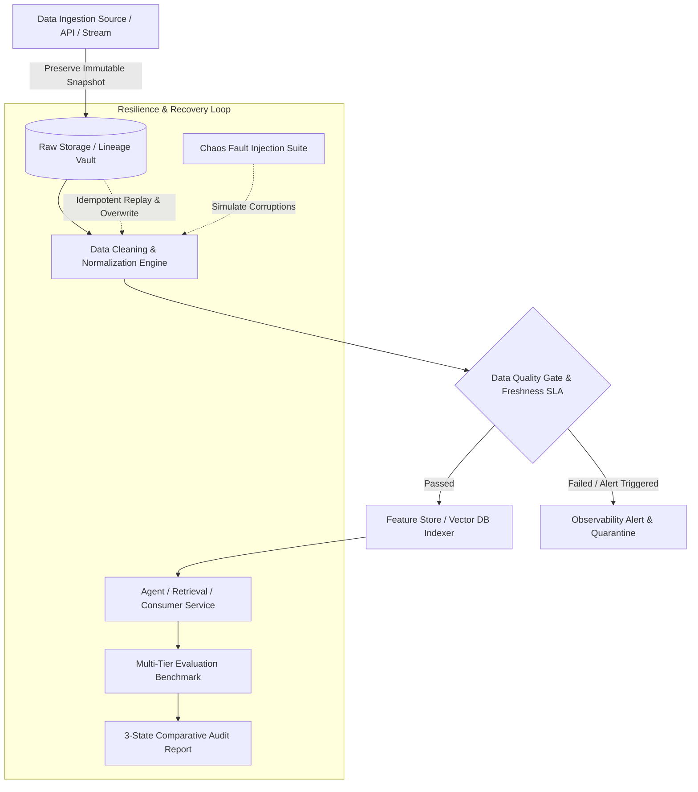

# Enterprise Data Pipeline & Observability Skill (Runbook & Architectural Blueprint)

## Scope and routing

Owns reliability of data as it moves from source records through transformation and indexing, including lineage, freshness, data gates, and replay/repair. It does not own application logs/traces or general answer-quality evaluation. Use [LLMOps Observability](../llmops_observability_skill/SKILL.md) for runtime telemetry and [AI Evaluation](../ai_evaluation_skill/SKILL.md) for response-quality benchmarks.

## Applying this skill

Apply only the pipeline controls relevant to the task. Inspect existing data contracts, storage, and recovery semantics before changing them; verify dependency/version assumptions against the repository. Prefer deterministic fixtures and local tests, avoid unnecessary live-source calls, and never expose secret values.

## 1. Core Philosophy: Eliminating "Silent Failures" in AI & Data Systems

In classical software engineering, pipeline bugs usually trigger explicit runtime exceptions (HTTP 500, null pointer, syntax error) that immediately halt execution. In **AI, RAG, and Agentic Systems**, data corruption manifests as **Silent Failures**:
- **Stale Data (Ingestion Failure):** Ingestion pipelines skip recent streams, causing LLMs/Agents to hallucinate outdated business facts with high fluency and false confidence.
- **Malformed Documents (Cleaning Failure):** Unstripped HTML/tags or truncated fields result in severe semantic vector distortion, leading retrieval models to pull irrelevant contexts.
- **Duplicate Records (CDC / Upsert Failure):** Duplicate chunks overwhelm top-$K$ context windows, starving out critical evidence.



---

## 2. 7-Layer Generalized Architectural Blueprint

Every production-grade data pipeline managed under this skill MUST implement the following seven layers:

| Layer | Functional Purpose | Invariant / Production Guarantee |
| :--- | :--- | :--- |
| **1. Raw Lineage Preservation** | Ingest source records and store an untouched bit-for-bit snapshot. | **Immutability:** Never overwrite raw archives. Ensures full replayability without hitting rate-limited external APIs. |
| **2. Deterministic Transformation** | Clean, normalize, parse dates, deduplicate, and assemble vector embedding contexts. | **Purity:** Given identical raw inputs, transformation must produce identical clean datasets. |
| **3. Declarative Quality Gate** | Execute schema, value, nullness, uniqueness, and length checks (GX 1.x ephemeral mode). | **Zero-Pollution:** Corrupt batches are quarantined before reaching downstream storage. |
| **4. Temporal Freshness SLA** | Calculate age distribution and enforce maximum staleness thresholds ($T_{stale} \le \text{SLA}$). | **Recency Guarantee:** Flags and alerts when data freshness drift occurs. |
| **5. Vector Indexing / Storage** | Generate dense vector embeddings and upsert into collection stores (Chroma, Qdrant, Pinecone). | **Idempotent Upsert:** Re-running indexing must update or cleanly replace without duplicating documents. |
| **6. Multi-Tier Evaluation** | Measure Retrieval Hit Rate (Recall@K), Lexical Token F1, and Semantic LLM-as-a-Judge scores. | **Quantifiable Quality:** Changes in data quality directly map to end-to-end benchmark scores. |
| **7. Chaos Testing & Idempotent Repair** | Inject 6 real-world data faults, verify detection, and perform 1-click self-healing recovery. | **Disaster Resilience:** Validates fail-safes and outputs a 3-State Comparative Audit Matrix. |

---

## 3. Step-by-Step Execution Guide for Agents

When an Agent is triggered to audit, build, or remediate a data pipeline repository, follow this deterministic sequence:

### Phase 1: Environment & Dependency Audit
1. **Inspect Workspace Configuration:**
   - Verify Python $\ge 3.11$ environment.
   - Inspect package managers (`pyproject.toml`, `requirements.txt`, or `uv.lock`).
   - Validate critical dependencies: `pandas`, `great-expectations >= 1.0.0`, `sentence-transformers`, `chromadb`, `pydantic >= 2.0`, `python-dotenv`.
2. **Environment Variable Hygiene:**
   - Verify `.env.example` exists. Ensure secrets (`API_KEY`) are NEVER hardcoded into source files or version control.
   - Set up offline fallback mode to ensure local unit/integration tests run reliably without network dependency.

### Phase 2: Implement Raw Ingestion & Lineage Storage
1. Implement a source fetcher conforming to `BaseIngestionSource`:
   ```python
   def fetch_source_records(settings: Settings) -> list[Record]:
       # 1. Fetch from live API with exponential backoff retry (429/503 handling)
       # 2. Persist raw response to settings.paths.raw_api_response
       # 3. Parse into structured Record dataclasses
       # 4. Save normalized JSON records to settings.paths.raw_records_json
   ```
2. Include automatic fallback loading from local snapshot if live network requests fail.

### Phase 3: Implement Cleaning, Feature Assembly & Deduplication
1. Strip residual markup (HTML/XML tags), normalize whitespace, and trim string fields.
2. Standardize timestamp formatting to ISO-8601 UTC and compute temporal feature `age_days = (run_date - published).days`.
3. Synthesize downstream context columns (e.g., `text_for_embedding` combining Title, Authors, Categories, Published Date, and Summary).
4. Perform deduplication against natural unique keys (e.g., `id` or `doi`).

### Phase 4: Configure Enterprise Quality Gate (Great Expectations 1.x)
1. Use modern **GX 1.x Ephemeral Context** (in-memory, zero file pollution):
   ```python
   import great_expectations as gx
   import great_expectations.expectations as gxe

   context = gx.get_context(mode="ephemeral")
   data_source = context.data_sources.add_pandas(name="pipeline_source")
   data_asset = data_source.add_dataframe_asset(name="pipeline_asset")
   batch_def = data_asset.add_batch_definition_whole_dataframe("pipeline_batch")
   batch = batch_def.get_batch(batch_parameters={"dataframe": df})
   ```
2. Define the core 4 expectation barriers:
   - `ExpectTableRowCountToBeBetween(min_value=N_min, max_value=N_max)`
   - `ExpectColumnValuesToNotBeNull(column="<mandatory_field>")`
   - `ExpectColumnValuesToBeUnique(column="<primary_key>")`
   - `ExpectColumnValueLengthsToBeBetween(column="<content_field>", min_value=30)`
3. Calculate **Freshness SLA**:
   - Compute percentage of records where `age_days > threshold_days`.
   - If ratio $> \text{threshold}$ (e.g. 25%), flag `is_fresh = False` and log warning report.

### Phase 5: Build Vector Indexing & Ground-Truth Test Suite
1. Upsert processed documents into vector collections with metadata filtering capabilities.
2. Formulate a balanced Ground-Truth Test Set (`test_set.json`) covering 4 question archetypes:
   - `Summary/Content extraction`
   - `Entity/Author identification`
   - `Temporal/Date inquiries`
   - `Category/Taxonomy classification`
3. Execute Phase 1 Baseline Pipeline and persist benchmark metrics:
   - Retrieval Hit Rate (Recall@K)
   - Token-level Lexical F1 Score
   - LLM Judge Semantic Rating (1 to 5)

### Phase 6: Chaos Fault Injection & Resilience Testing
Simulate 6 standard industry corruption scenarios using `ChaosDataInjector`:
1. **Drop latest records:** Simulates upstream stream ingestion cut-offs.
2. **Blank mandatory fields:** Simulates scraper or extraction null payloads.
3. **Inject noise:** Simulates character encoding corruption or garbage token injection.
4. **Truncate headers/identifiers:** Simulates field buffer overflow or regex stripping errors.
5. **Stale timestamps:** Simulates out-of-sync clocks or backlog processing delays.
6. **Duplicate rows:** Simulates retry storms and missing CDC idempotency.

### Phase 7: Idempotent Self-Healing & 3-State Comparative Audit
1. Execute retrieval on corrupted data $\rightarrow$ Record degraded metrics.
2. Trigger **Idempotent Repair**:
   - Re-read pristine records from `data/raw/`.
   - Re-run transformation and Quality Gate validation.
   - Re-index Vector DB cleanly.
3. Generate **3-State Comparative Audit Report** (`Baseline` vs `Corrupted` vs `Repaired`) documenting delta recovery.

---

## 4. Reusable Code Templates & Module Map

Templates are located in [`templates/`](templates/):

- [`base_pipeline.py`](templates/base_pipeline.py): Abstract pipeline contracts and orchestration.
- [`quality_gate.py`](templates/quality_gate.py): Great Expectations 1.x and native validation rules.
- [`freshness_monitor.py`](templates/freshness_monitor.py): Temporal SLA calculation and staleness detection.
- [`chaos_injector.py`](templates/chaos_injector.py): Controlled data-fault scenarios.
- [`evaluator.py`](templates/evaluator.py): Pipeline-specific baseline/corrupted/repaired comparison; use AI Evaluation for broader answer-quality benchmarking.
- [`idempotent_repair.py`](templates/idempotent_repair.py): Raw replay and comparative repair audit.

---

## 5. Edge Cases, Anti-Patterns & Production Best Practices

### ⚠️ Critical Anti-Patterns to Avoid:
1. **Deprecated GX Syntax:** Do NOT use legacy Great Expectations 0.18 syntax (e.g. `context.sources.pandas_default` or `context.add_datasource`). GX 1.x requires `context.data_sources.add_pandas(...)` and `context.validation_definitions.add(...)`.
2. **Mutating In-Memory Raw Data:** Never transform records in-place without preserving raw payloads. Doing so destroys data lineage and prevents idempotent recovery.
3. **Hardcoding Absolute OS Paths:** Never use absolute paths like `C:\Users\...` or `/home/...`. Always use relative paths resolved via `Path(__file__).resolve().parents[...]` or centralized `Paths` dataclasses.
4. **Evaluating Only Lexical Metrics:** Lexical Token F1 alone fails on valid paraphrases. Always pair Retrieval Hit Rate with Token F1 and LLM-as-a-Judge semantic scoring.
5. **Ignoring Rate-Limits (HTTP 429):** Raw ingestion must always feature exponential backoff retry and a persistent local fallback snapshot for CI/CD offline predictability.

---

## 6. Production Acceptance Checklist

Before marking any pipeline implementation as complete, verify this checklist:

- [ ] **Data Lineage:** Raw API response and parsed records are preserved immutably in `data/raw/`.
- [ ] **Schema & Data Quality:** Quality gate runs GX 1.x ephemeral mode and reports 100% pass on clean data.
- [ ] **Freshness SLA:** Staleness monitor accurately calculates data age distribution and enforces SLA limits.
- [ ] **Vector Persistence:** Vector index is successfully populated, queryable, and smoke-tested.
- [ ] **Ground Truth Benchmark:** Test set covers multi-faceted question types with quantifiable Hit Rate and Token F1.
- [ ] **Chaos Resilience:** 6 corruption scenarios trigger observable metric degradation in corrupted reports.
- [ ] **Idempotent Recovery:** Pipeline re-runs from raw snapshots without manual patching and restores all baseline scores.
- [ ] **Audit Report:** 3-State comparative report (`Baseline` vs `Corrupted` vs `Repaired`) is generated with delta analysis.
