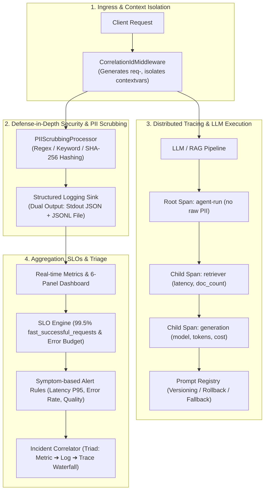

# LLMOps Observability, Distributed Tracing & Incident Triage Skill

## 🌟 Overview & Purpose
The `llmops-observability` skill is an enterprise-grade, domain-agnostic engineering framework designed to establish full-lifecycle observability, security guardrails, cost governance, prompt versioning, and automated incident triage for LLM/RAG applications.

It provides a unified bridge connecting the **Observability Triad (Metrics ➔ Logs ➔ Traces)** with modern LLMOps practices (Prompt Registries, SLOs, Error Budgets, and Automated Root-Cause Triage).

---

## 🏛 Architectural Triad Blueprint



---

## 📂 Package & Template Structure

```text
skills/llmops_observability_skill/
├── SKILL.md                  # Autonomous Agent Runbook, Execution Blueprint & Checklist
├── README.md                 # Developer & Architecture Integration Handbook
└── templates/                # Production-grade Generic Reusable Python Modules
    ├── __init__.py           # Package exports
    ├── config_schemas.py     # Pydantic schemas (SLOConfig, AlertRule, DashboardPanelSpec)
    ├── pii_scrubber.py       # Precompiled regex engine & recursive PII redaction
    ├── logging_pipeline.py   # Structlog configuration with contextvars & JSONL processor
    ├── middleware.py         # FastAPI/Starlette CorrelationId middleware & timer
    ├── tracer.py             # Vendor-agnostic tracer (Langfuse & NoOp fallback)
    ├── prompt_manager.py     # Dynamic prompt resolver, versioning & zero-downtime rollback
    ├── metrics_evaluator.py  # Latency percentiles (P50..P99), Token Cost model, SLO tracker
    └── incident_debugger.py  # Automated Triad Correlator (Metric ➔ Log ➔ Trace)
```

---

## 🚀 Quickstart Integration Guide

### 1. Configure Structured Logging with In-Stream PII Scrubbing
```python
from templates.logging_pipeline import configure_structured_logging, get_structured_logger

configure_structured_logging(log_path="data/logs.jsonl", log_level="INFO")
log = get_structured_logger()

# Log entries will automatically scrub emails, phones, national IDs, and credit cards
log.info("user_authenticated", user_id_hash="a1b2c3d4e5f6", payload={"contact": "user@example.com"})
```

### 2. Plug Middleware into FastAPI / ASGI
```python
from fastapi import FastAPI
from templates.middleware import CorrelationIdMiddleware

app = FastAPI()
app.add_middleware(CorrelationIdMiddleware)
```

### 3. Instrument Distributed Traces and Managed Prompts
```python
from templates.tracer import create_tracer
from templates.prompt_manager import PromptManager

tracer = create_tracer("langfuse")
prompt_mgr = PromptManager(default_label="production")

with tracer.trace_context(name="chat-pipeline", user_id="hashed_user_123"):
    resolved_prompt = prompt_mgr.resolve("chat-rag", variables={"question": "How do I configure SLOs?"})
    # Run LLM generation with resolved_prompt.text
```

### 4. Execute Automated Incident Triage
```python
from templates.incident_debugger import IncidentCorrelator

correlator = IncidentCorrelator(log_path="data/logs.jsonl")
report = correlator.generate_incident_report(
    incident_id="INC-2026-001",
    time_window="2026-10-02 08:00Z - 09:00Z",
    latency_threshold_ms=3000.0
)

print(f"Systemic cause: {report.systemic_root_cause}")
for sample in report.triaged_samples:
    print(f"[{sample.correlation_id}] Bottleneck span: {sample.culprit_span} took {sample.culprit_percentage}%")
```

---

## 🔒 Security & Privacy Guarantees
- **Zero Raw PII in Traces & Logs**: Input queries and prompt templates are summarized and scrubbed prior to log serialization or trace propagation.
- **Context Isolation**: `clear_contextvars()` is executed per request in middleware to guarantee no state leakage between concurrent coroutines.
- **Non-blocking Telemetry**: In the event of observability network downtime (e.g. Langfuse unreachable), the system silently falls back to local logging and `NoOpTracer` without interrupting user requests.
