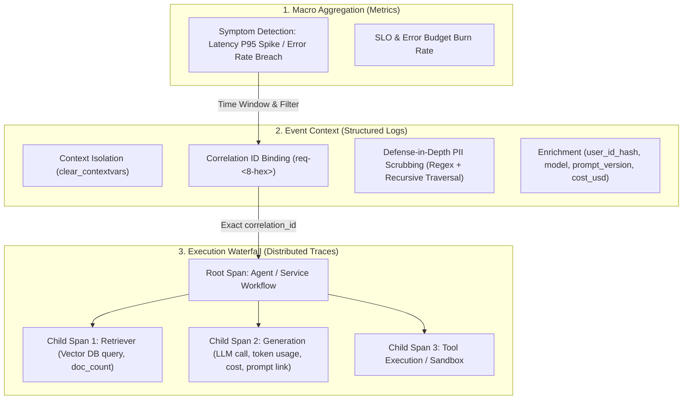
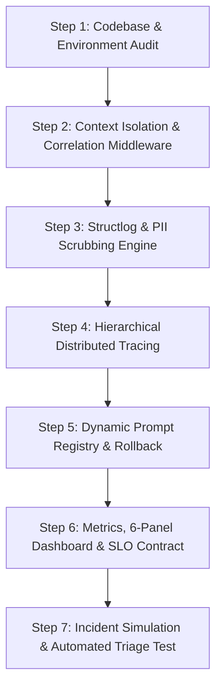

# LLMOps Observability, Distributed Tracing & Incident Triage Skill

## Scope and routing

Owns application-runtime signals and their correlation across metrics, logs, and traces, plus prompt lifecycle and SLO triage. PII scrubbing here protects telemetry sinks; it is not a substitute for user-output or egress guardrails. Use [Data Pipeline Observability](../data_pipeline_observability/SKILL.md) for ingestion/index reliability and [Responsible Agent Guardrails](../responsible_agent_guardrails_skill/SKILL.md) for security decisions.

## Applying this skill

Apply only the telemetry layers needed for the task. Inspect existing logging/tracing conventions and privacy requirements first; verify vendor APIs, dependency versions, and SLO targets locally. Prefer no-op/local telemetry in tests, avoid unnecessary external calls, and never print credentials or raw sensitive payloads.

## 1. Skill Specification & Trigger Context

This skill equips autonomous AI agents and systems architects with a standard blueprint to implement, audit, and debug enterprise-grade observability pipelines for generative AI, agentic systems, and RAG architectures.

### Trigger Keywords & Activation Scenarios
Activate this skill when:
- Building, inspecting, or refactoring telemetry, logging, or tracing for an LLM/RAG backend.
- Designing or auditing structured JSON/JSONL logging with PII/secret scrubbing and context propagation (`correlation_id`).
- Integrating distributed tracing systems (e.g. Langfuse, OpenTelemetry, Arize Phoenix) with parent-child span waterfalls (`agent-run` ➔ `retrieval` ➔ `generation`).
- Implementing prompt registries, version tracking, label promotions (`production`, `candidate`), and instant rollbacks.
- Formulating SRE-style SLOs (Service Level Objectives), error budgets, symptom-based alerting rules, and observability dashboards.
- Performing automated incident investigation (Triage) by traversing the **Observability Triad: Metrics ➔ Logs ➔ Traces**.

---

## 2. Core Philosophy & Architectural Blueprint

### The Mental Model: Observability Triad in LLMOps
Observability in generative AI is non-trivial because errors manifest not just as HTTP 5xx exceptions, but as silent latency regressions (RAG vector DB slowdowns), cost spikes (prompt inflation), and quality degradation (hallucinations/uncalibrated outputs).

### Core Architecture Principles
1. **Defense-in-Depth PII Scrubbing**: PII must be redacted in the logging pipeline processor before serialization, ensuring that accidental unredacted user inputs never hit disk or telemetry sinks.
2. **Context Isolation**: Always execute `clear_contextvars()` per request in ASGI middleware to prevent async coroutine context pollution.
3. **Decoupled Prompt Management**: Never hard-code production prompt strings in application code. Use a multi-tier fallback resolver (`Registry` ➔ `Local Cached Template` ➔ `In-Code Fallback`).
4. **Symptom-Based Alerting**: Alert on user-visible symptoms (P95 latency, error rates, quality drops) rather than transient internal causes (CPU spikes, temporary cache misses).
5. **Deterministic Correlatability**: Every metric anomaly links to a structured log event via timestamps/filters, which links directly to a trace waterfall via `correlation_id`.

---

## 3. Step-by-Step Execution Guide for Agents

When activated on an existing or greenfield repository, the Agent must execute the following deterministic runbook:

### Step 1: Codebase & Environment Audit
- **Examine dependencies**: Verify `structlog`, `pydantic`, `fastapi`, `langfuse` (or OTel equivalents).
- **Inspect entry points**: Identify all user-facing HTTP endpoints, background workers, and LLM invocation wrappers.
- **Check environment flags**: Verify `APP_ENV`, `LOG_LEVEL`, `LANGFUSE_PUBLIC_KEY`, `LANGFUSE_SECRET_KEY`, `LOG_PATH`.

### Step 2: Context Isolation & Correlation Middleware
- Implement `CorrelationIdMiddleware` inheriting from Starlette `BaseHTTPMiddleware`.
- Clear context on dispatch: `clear_contextvars()`.
- Extract `x-request-id` or generate `req-<8-hex>` via `uuid.uuid4().hex[:8]`.
- Bind `correlation_id` to contextvars and set `response.headers["x-request-id"]` + `response.headers["x-response-time-ms"]`.

### Step 3: Structlog & PII Scrubbing Engine
- Configure Structlog pipeline with `JsonlFileProcessor` and `PIIScrubbingProcessor`.
- Scrub all non-system payload fields against precompiled regexes (Email, Phone VN/Intl, National ID / CCCD 12 digits, Credit Cards, API keys, JWTs).
- Pseudonymize user IDs using deterministic SHA-256 slice (`hash_user_id`).
- Ensure structured log format matches strict schema:
  - Event types: `app_started`, `request_received`, `response_sent`, `request_failed`.
  - Required fields: `ts`, `level`, `service`, `correlation_id`, `user_id_hash`, `session_id`, `feature`, `model`, `env`, `latency_ms`, `ttft_ms`, `tokens_in`, `tokens_out`, `cost_usd`, `quality_score`.

### Step 4: Hierarchical Distributed Tracing
- Wrap the main orchestration handler in a Root Span (e.g. `@observe(name="agent-run", as_type="agent", capture_input=False, capture_output=False)`).
- Instrument sub-operations as child spans:
  - **Retriever Span**: Records `doc_count`, query preview (summarized & sanitized).
  - **Generation Span**: Records `model`, `usage` (`input_tokens`, `output_tokens`), computed `cost_usd`, and links the managed prompt.
- Propagate `user_id_hash`, `session_id`, `correlation_id`, and `environment` in trace metadata.

### Step 5: Dynamic Prompt Registry & Rollback
- Implement `PromptManager.resolve(prompt_name, variables, label="production")`.
- When fetching remote prompts fails, seamlessly degrade to local template fallback without throwing 500 errors to the client.
- Provide programmatic rollback capability: updating prompt label pointer (e.g. promoting `candidate` to `production` or reverting to `baseline`).

### Step 6: Metrics, 6-Panel Dashboard & SLO Contract
- Formulate 6 core metric panels:
  1. **Latency Percentiles & TTFT**: P50, P95, P99, TTFT P95 (threshold: P95 <= 3000ms).
  2. **Traffic & Request Rate**: Total count, rate per minute.
  3. **Error Rate & Tool Success**: Error % (threshold <= 2%), retrieval success %.
  4. **Cost Over Time**: USD consumption sum by minute & cumulative.
  5. **Token Volume**: Input and output tokens volume.
  6. **Quality Heuristics**: Mean quality score (0.0 to 1.0, threshold >= 0.75).
- Define primary SLO (e.g. 99.5% fast successful requests in 28d window) and error budget formula:
  $$\text{Error Budget} = (100\% - \text{SLO Target}) \times \text{Total Requests}$$

### Step 7: Incident Simulation & Automated Triage Test
- Inject fault (e.g. slow retrieval, API downstream error).
- Run automated triage:
  1. Identify metric anomaly (e.g. P95 latency > 3000ms).
  2. Query correlated log record in `data/logs.jsonl` to obtain `correlation_id`.
  3. Open trace waterfall using `correlation_id` and pinpoint culprit span duration percentage.
  4. Generate automated root-cause analysis report.

---

## 4. Reusable Code Templates & Patterns

All modular templates are located in [`templates/`](templates/):

### 1. PII Redaction & Hashing ([`pii_scrubber.py`](templates/pii_scrubber.py))
- Precompiled regex dictionary for high throughput.
- Recursive nested dictionary/list sanitizer.
- SHA-256 pseudonymizer for identifiers.

### 2. Context Isolation Middleware ([`middleware.py`](templates/middleware.py))
- High-performance Starlette middleware with nanosecond-precision timing.
- Auto-header injection (`x-request-id`, `x-response-time-ms`).

### 3. Structured Logging Pipeline ([`logging_pipeline.py`](templates/logging_pipeline.py))
- Integrated Structlog engine with UTC ISO-8601 timestamps.
- Thread-safe JSONL file appender and stdout formatter.

### 4. Distributed Tracer ([`tracer.py`](templates/tracer.py))
- Universal tracer interface with graceful No-Op fallback when telemetry is unreachable.

### 5. Multi-Tier Prompt Resolver ([`prompt_manager.py`](templates/prompt_manager.py))
- Remote registry client integration with safe local formatting fallback.

### 6. Incident Triad Correlator ([`incident_debugger.py`](templates/incident_debugger.py))
- Correlates metric anomalies ➔ log lines ➔ trace span waterfalls to isolate bottlenecks.

---

## 5. Edge Cases, Anti-Patterns & Best Practices

| Category | Anti-Pattern (What to Avoid) | Best Practice (What to Do) |
| :--- | :--- | :--- |
| **Logging Security** | Logging raw user prompts or unhashed IDs directly in log payloads. | Apply recursive PII scrubber processor before serialization; hash all user IDs with salted SHA-256. |
| **Context Leaks** | Reusing global variables or omitting `clear_contextvars()`, leaking IDs across concurrent coroutines. | Clear context variables at the immediate start of middleware dispatch. |
| **Telemetry Failure** | Allowing Langfuse or OpenTelemetry network drops to crash user-facing requests. | Wrap tracing in try-except or use `NoOpTracer` fallback when credentials or backend are down. |
| **Prompt Delivery** | Hard-coding prompt strings in code; redeploying entire app to change a prompt. | Use managed prompt registries with labels (`production`, `candidate`) and local fallback templates. |
| **SLO & Alerting** | Alerting on cause-based metrics like CPU spikes or 1 failed request. | Configure symptom-based SLOs on P95 latency (e.g. <=3000ms) and windowed error budgets. |
| **Span Hierarchy** | Creating a flat trace list without parent-child relationships. | Build hierarchical tree: Root (`agent-run`) ➔ Child 1 (`retriever`) ➔ Child 2 (`generation`). |

---

## 6. Definition of Done & Quality Checklist

Before finalizing any LLMOps Observability task, the Agent must verify every item:

- [ ] **Middleware & Context**: `CorrelationIdMiddleware` active, generates `req-<8-hex>`, clears contextvars, and passes `x-request-id` in response headers.
- [ ] **Structured Logging**: All logs written in valid JSONL to `data/logs.jsonl` conforming to schema (`event`, `correlation_id`, `user_id_hash`, `tokens_in`, `tokens_out`, `cost_usd`, `latency_ms`).
- [ ] **PII Redaction**: Email, Phone, National ID (CCCD), and Credit Cards are replaced with `[REDACTED_*]` across all log events. Zero raw PII on disk.
- [ ] **Distributed Tracing**: Root and child spans recorded on Langfuse/OTel with `correlation_id` stored in metadata for 100% log-trace correlation.
- [ ] **Prompt Management**: Remote prompt resolved with version tag; local fallback active if registry is offline; label rollback tested.
- [ ] **SLO & Dashboard**: 6 panels populated from runtime logs; SLO error budget accurately computed.
- [ ] **Incident Verification**: Incident triage validated by traversing Metric Anomaly ➔ Structured Log ➔ Culprit Span in Trace Waterfall.
