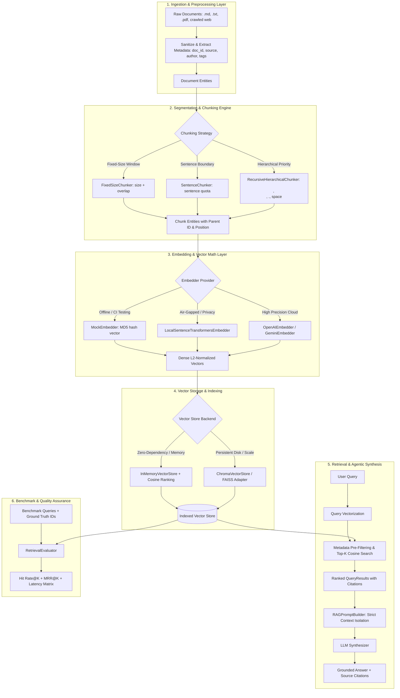

# RAG Data Foundation & Vector Knowledge Pipeline Skill

## 1. Skill Overview & Trigger Criteria

This skill provides a generalized, production-ready methodology for converting raw document corpora into high-performance vector search indexes and agentic knowledge retrieval systems (RAG).

### Activation Triggers & Keywords
Agents should activate this skill when encountering tasks involving:
- **Keywords:** `rag pipeline`, `vector store`, `embedding`, `chunking`, `knowledge base agent`, `semantic search`, `similarity retrieval`, `chromadb`, `sentence-transformers`, `cosine similarity`, `document indexing`.
- **System Scenarios:**
  - Designing a new knowledge retrieval system or AI agent assistant over private data.
  - Implementing or benchmarking text segmentation strategies (fixed size, sentence boundary, recursive hierarchical).
  - Abstracting multiple embedding providers (Local, OpenAI, Gemini, Mock) with unified vector math.
  - Adding metadata-filtered semantic search, collection CRUD, and document lifecycle management.
  - Evaluating retrieval quality quantitatively via Hit Rate@K, MRR@K, and latency profiling.

---

## 2. Core Philosophy & Architectural Blueprint

### Key Architectural Principles
1. **Data Lineage & Provenance (Document Immutability):** Every chunk retains its `parent_doc_id`, offset indices, and source attributes to allow deterministic audits and full document deletion.
2. **Provider Decoupling via Strategy Pattern:** Embeddings and Vector Stores are abstracted behind strict interfaces (`BaseEmbedder`, `BaseVectorStore`), enabling seamless switches between local mock, CPU inference, and cloud APIs.
3. **Structured Pre-Filtering:** Metadata filtering must execute *prior* to vector scoring to reduce similarity candidate spaces and enforce multi-tenant isolation.
4. **Evaluation-Driven Optimization:** Chunk sizes, overlap ratios, and retrieval parameters ($K$, similarity thresholds) must be tuned via quantitative metrics (Hit Rate@K, MRR), not intuition.

---

## 3. Step-by-Step Execution Guide for Agents

When implementing or auditing a RAG vector system on any codebase, follow these deterministic phases:

### Phase 1: Ingestion & Document Lineage Audit
1. Inspect input directories and file formats (`.md`, `.txt`, `.json`, HTML, CSV manifests).
2. Validate document parsing: Ensure text is decoded as UTF-8, stripped of corrupted whitespace/control characters, and assigned a deterministic `doc_id`.
3. Enrich document metadata with: `source`, `file_type`, `retrieved_at`, and structural domain tags.

### Phase 2: Chunking Strategy Selection & Calibration
1. **Short FAQ / Atomic Q&A Data:** Use `SentenceChunker` (1–3 sentences per chunk) to avoid mixing topics.
2. **Technical Manuals / Markdown Documents:** Use `RecursiveHierarchicalChunker` (separators: `["\n\n", "\n", ". ", " ", ""]`) with `chunk_size=500..1000` and `overlap=50..100`.
3. **Continuous Unstructured Text:** Use `FixedSizeChunker` with sliding overlap (10–20% of `chunk_size`).
4. Run `ChunkingStrategyComparator` to verify chunk length variance and prevent oversized chunks from exceeding model context limits.

### Phase 3: Embedding Backend Resolution & Fallbacks
1. Resolve the environment configuration (`EMBEDDING_PROVIDER`):
   - If offline/unit testing: Instantiate `MockEmbedder(dim=64)` for deterministic instant execution.
   - If local execution without API keys: Instantiate `LocalSentenceTransformersEmbedder`.
   - If cloud credentials exist: Instantiate `OpenAIEmbedder` or `GeminiEmbedder`.
2. Guarantee defensive vector calculations:
   - Handle zero-length strings gracefully.
   - Compute normalized cosine similarity: $\frac{A \cdot B}{\|A\|_2 \|B\|_2}$. If $\|A\|=0$ or $\|B\|=0$, return `0.0` (prevent division by zero).

### Phase 4: Vector Indexing, Pre-Filtering & Lifecycle Management
1. Index documents in batches rather than singular calls to maximize throughput.
2. Support multi-attribute structured pre-filtering (`department`, `language`, `version`, `category`).
3. Implement cascading deletion: When `delete_document(doc_id)` is invoked, purge all associated chunk records matching `parent_doc_id == doc_id`.

### Phase 5: KnowledgeBaseAgent & Guardrailed Prompt Synthesis
1. Configure `RAGPromptBuilder` with strict contextual bounds:
   - Inject source IDs into context headers (e.g., `[Source: doc_id_chunk_1]`).
   - Add negative constraint: If context is insufficient, explicitly report lack of information rather than hallucinating.
2. Set `min_relevance_score` threshold (e.g., 0.3 for cosine similarity) to discard noise before prompt assembly.

### Phase 6: Automated Evaluation Matrix
1. Construct a minimum set of 5–10 representative `BenchmarkQuery` items with known expected document IDs.
2. Run `RetrievalEvaluator` to compute:
   - **Hit Rate@K:** Proportion of queries where at least one ground-truth document was retrieved in top-$K$.
   - **MRR@K (Mean Reciprocal Rank):** Average reciprocal rank of the first relevant document ($\frac{1}{\text{rank}}$).
   - **Latency (ms):** Average search duration per query.

---

## 4. Reusable Code Templates Reference

All generic, production-ready modules are available in the `templates/` subdirectory:
- [templates/models.py](file:///c:/Users/Vxtor/Documents/workspace/ai20k/K4-L3A-Data-Foundations/skills/rag_data_foundation_skill/templates/models.py): `Document`, `Chunk`, `QueryResult`, `BenchmarkQuery`, `EvaluationResult`
- [templates/config.py](file:///c:/Users/Vxtor/Documents/workspace/ai20k/K4-L3A-Data-Foundations/skills/rag_data_foundation_skill/templates/config.py): `PipelineConfig`, `ChunkerConfig`, `EmbedderConfig`, `StoreConfig`
- [templates/chunking.py](file:///c:/Users/Vxtor/Documents/workspace/ai20k/K4-L3A-Data-Foundations/skills/rag_data_foundation_skill/templates/chunking.py): `BaseChunker`, `FixedSizeChunker`, `SentenceChunker`, `RecursiveHierarchicalChunker`, `ChunkingStrategyComparator`
- [templates/embeddings.py](file:///c:/Users/Vxtor/Documents/workspace/ai20k/K4-L3A-Data-Foundations/skills/rag_data_foundation_skill/templates/embeddings.py): `BaseEmbedder`, `MockEmbedder`, `LocalSentenceTransformersEmbedder`, `OpenAIEmbedder`, `GeminiEmbedder`, `cosine_similarity`
- [templates/store.py](file:///c:/Users/Vxtor/Documents/workspace/ai20k/K4-L3A-Data-Foundations/skills/rag_data_foundation_skill/templates/store.py): `BaseVectorStore`, `InMemoryVectorStore`, `ChromaVectorStore`
- [templates/agent.py](file:///c:/Users/Vxtor/Documents/workspace/ai20k/K4-L3A-Data-Foundations/skills/rag_data_foundation_skill/templates/agent.py): `KnowledgeBaseAgent`, `RAGPromptBuilder`
- [templates/pipeline.py](file:///c:/Users/Vxtor/Documents/workspace/ai20k/K4-L3A-Data-Foundations/skills/rag_data_foundation_skill/templates/pipeline.py): `RAGPipeline`
- [templates/evaluation.py](file:///c:/Users/Vxtor/Documents/workspace/ai20k/K4-L3A-Data-Foundations/skills/rag_data_foundation_skill/templates/evaluation.py): `RetrievalEvaluator`

---

## 5. Edge Cases, Anti-Patterns & Defensive Guidelines

| Risk / Anti-Pattern | Manifestation | Defensive Remedy |
| :--- | :--- | :--- |
| **Context Fragmentation** | Chunking splits a critical sentence or code snippet in half. | Use `RecursiveHierarchicalChunker` with adequate overlap (15-20% chunk size) and logical paragraph separators. |
| **Zero-Magnitude Vector Division** | An empty string or uniform vector causes `ZeroDivisionError` in cosine similarity calculation. | Check vector norm before division: if $\|v\| = 0.0$, return `0.0` immediately. |
| **Dimension Mismatch** | Storing vectors from model A (e.g. 384-dim) and querying with model B (e.g. 1536-dim). | Store `embedding_dim` and `model_name` in vector collection metadata; enforce assertion on search entry. |
| **Silent Retrieval Degradation** | Top-K returns low-scoring, irrelevant chunks which pollute LLM context. | Enforce `min_relevance_score` cut-off before prompt formatting; return fallback message if no chunk qualifies. |
| **Orphaned Vector Records** | Updating a document leaves old chunk vectors in the database. | Always execute `delete_document(doc_id)` before re-ingesting modified documents. |
| **Local Model Cold Start / OOM** | Initializing large Hugging Face models inside request threads causes latency spikes or OOM. | Lazy-load model singletons and configure batch sizes with fallback to CPU/Mock. |

---

## 6. Technical Acceptance Checklist

Before certifying a RAG vector foundation as production-ready, verify all criteria:

- [ ] **Data Model Validation:** `Document` and `Chunk` support arbitrary JSON-serializable metadata and maintain parent-child linkage.
- [ ] **Chunking Coverage:** Text segmentation functions produce valid non-empty chunks and respect `chunk_size` limits across empty, single-line, and multi-paragraph inputs.
- [ ] **Cosine Metric Stability:** `cosine_similarity` yields `1.0` for identical vectors, `0.0` for orthogonal / zero vectors, and `-1.0` for opposite vectors without exceptions.
- [ ] **Vector Store CRUD:**
  - Collection size reflects added documents/chunks.
  - Search returns results sorted strictly descending by similarity score.
  - `search_with_filter` excludes non-matching metadata records.
  - `delete_document` completely purges all chunks of the specified document ID.
- [ ] **RAG Prompt Integrity:** Formatted context includes clear document boundaries and source attributes without prompt injection vulnerabilities.
- [ ] **Retrieval Benchmark:** RetrievalEvaluator executes without error and reports quantitative metrics (`hit_rate_at_k`, `mrr_at_k`, `avg_latency_ms`).
