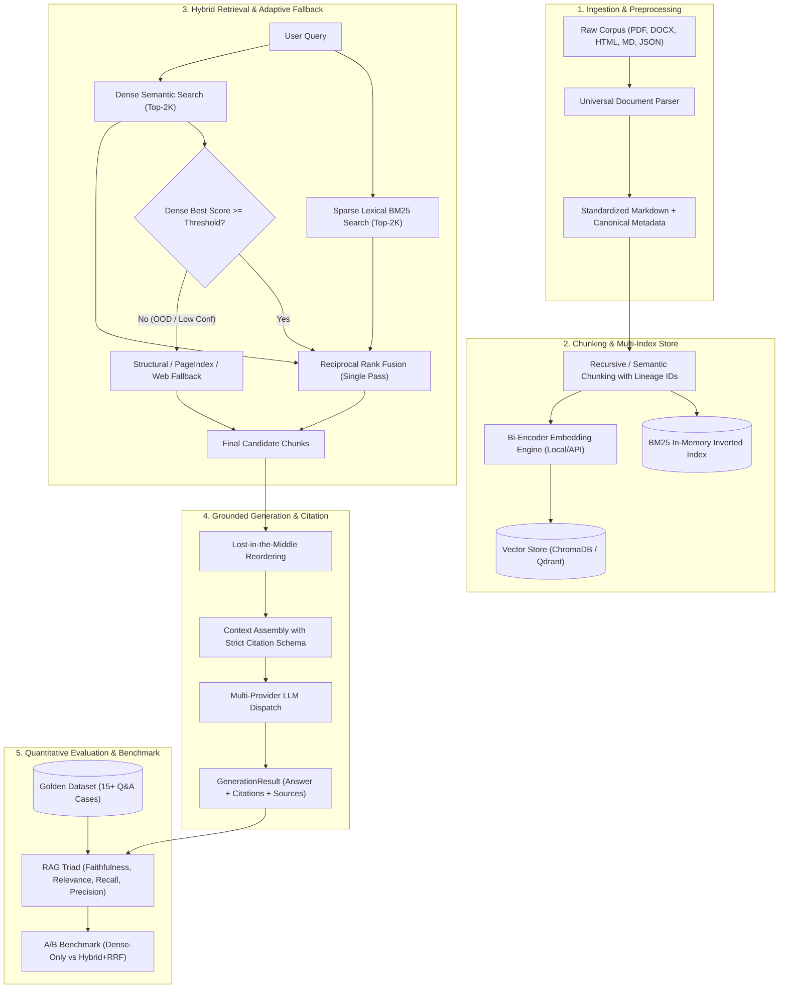

# Enterprise RAG Pipeline Skill

## Scope and routing

Owns system-level RAG composition and advanced retrieval/generation behavior: multi-format ingestion, dense+sparse fusion, fallback, evidence-grounded answers, and end-to-end comparison. It is not the default for isolated vector-store or chunker work. Use [RAG Data Foundation](../rag_data_foundation_skill/SKILL.md) for reusable components and [AI Evaluation](../ai_evaluation_skill/SKILL.md) when the task is primarily dataset validation, judge quality, or CI evaluation gates.

## Applying this skill

Apply only the pipeline phases required by the task. Inspect existing document contracts, retrieval providers, and tests first; calibrate thresholds on in-domain data rather than adopting example values blindly. Prefer local fixtures and avoid unnecessary external calls or secret exposure.

## 1. Executive Summary & Trigger Conditions

### Trigger Keywords & Contexts
- **Keywords:** `rag`, `retrieval augmented generation`, `hybrid search`, `rrf`, `reciprocal rank fusion`, `vector store`, `chromadb`, `bm25`, `lost in the middle`, `grounded generation`, `citation verification`, `ragas`, `golden dataset`.
- **When to activate this skill:**
  - Setting up a new production RAG system from scratch across heterogeneous data sources.
  - Designing or auditing Hybrid Retrieval engines (combining dense vector semantics with sparse keyword indexing).
  - Implementing robust rank fusion algorithms (RRF) and adaptive fallback routing for Out-of-Distribution (OOD) queries.
  - Mitigating LLM attention deficits (Lost-in-the-Middle) and enforcing strict anti-hallucination citation constraints.
  - Establishing quantitative evaluation suites (RAG Triad, Ragas metrics, A/B testing benchmarks).

---

## 2. Core Philosophy & Architectural Blueprint

### Core Engineering Invariants
1. **Separation of Concerns:** Keep Ingestion, Indexing, Retrieval, Generation, and Evaluation decoupled via strict typed contracts.
2. **Deterministic Provenance & Schema Integrity:** Every chunk retains its canonical `id`, `parent_id`, `source`, `title`, and `chunk_index` across the entire pipeline.
3. **Metric Scale Isolation in Hybrid Fusion:** Never add or directly compare dense cosine scores with sparse BM25 scores. Rank fusion must use **Reciprocal Rank Fusion (RRF)**:
   $$\text{RRF\_Score}(d) = \sum_{m \in M} \frac{1}{k + \text{rank}_m(d)}$$
4. **Independent Fallback Thresholding:** Fallback triggers (e.g. to structural index, PageIndex, or external search) MUST evaluate the **original dense cosine similarity score**, NEVER the RRF score.
5. **Lost-in-the-Middle Context Reordering:** LLMs attend disproportionately to the start and end of prompt context. Reorder retrieved chunks to place top candidates at the extremities: $[c_0, c_2, c_4, \dots, c_5, c_3, c_1]$.
6. **Strict Evidence Grounding & Safe Refusal:** If retrieved evidence does not support the query or falls below certainty thresholds, return a safe refusal rather than hallucinating.

### End-to-End Architecture Pipeline



---

## 3. Step-by-Step Execution Runbook for Agents

When deployed into any target codebase, the Agent must execute the following structured phases:

### Phase 1: Environment & Dependency Validation
1. Verify Python version (`>= 3.10`).
2. Inspect or install necessary dependencies:
   - Vector Store: `chromadb` / `qdrant-client` / `faiss-cpu`
   - Lexical Search: `rank-bm25`
   - Parsers: `markitdown[pdf]`, `pypdf`, `python-docx`
   - Embeddings & LLM: `sentence-transformers`, `openai`, `google-genai`, `anthropic`
   - Evaluation: `ragas`, `datasets`, `pytest`
3. Validate `.env` configuration for API keys (`OPENAI_API_KEY`, `GEMINI_API_KEY`, `ANTHROPIC_API_KEY`). Ensure keys are never committed.

### Phase 2: Ingestion & Document Standardization
1. Scan raw data directory (`data/raw/` or `data/landing/`).
2. Convert all heterogeneous document formats (PDF, DOCX, HTML, JSON) into clean Markdown.
3. Extract and normalize canonical metadata:
   - `id`: Unique identifier (e.g., file slug or hash).
   - `source`: Filename or originating URI.
   - `title`: Extracted header or normalized filename.
   - `doc_type`: Category classification (e.g. policy, manual, news).
   - `url`: Source URL (or `None`).
4. Save normalized outputs into `data/standardized/`.

### Phase 3: Chunking, Embedding & Indexing
1. Split documents using recursive text splitting (`chunk_size` = 500-1000 characters/tokens, `chunk_overlap` = 10-15%).
2. Assign deterministic IDs formatted as `{document_id}::chunk-{chunk_index}`.
3. Compute embeddings using the designated bi-encoder model (e.g., `BAAI/bge-m3` or `text-embedding-3-small`).
4. Upsert chunks into the Vector Store with cosine similarity distance metric.
5. Build the BM25 lexical index on the exact same set of chunk contents.

### Phase 4: Hybrid Retrieval & Fallback Pipeline
1. Query both Dense and BM25 retrievers overfetching $2 \times \text{top\_k}$ candidates.
2. Fuse the rankings using single-pass RRF ($k = 60$).
3. Check the maximum dense cosine similarity score against `dense_score_threshold` (calibrated between 0.30 and 0.45).
4. If score is below threshold, trigger fallback (e.g., PageIndex / structural routing). Wrap fallback in a `try...except` block so failure defaults back to hybrid results rather than crashing.

### Phase 5: Grounded Generation with Citations
1. Reorder retrieved chunks using `reorder_for_llm` to counteract Lost-in-the-Middle effects.
2. Construct the prompt with numbered document blocks containing title and source metadata.
3. Enforce strict citation rules in the system prompt.
4. If chunks are empty or below threshold with no fallback, emit safe refusal: *"Tôi không thể xác minh thông tin này từ các tài liệu được cung cấp."*

### Phase 6: Multi-Metric Evaluation & A/B Benchmarking
1. Assemble a Golden Benchmark dataset ($\ge 15$ diverse Q&A pairs with ground-truth context).
2. Measure 4 core metrics:
   - **Faithfulness:** Are all generated claims supported by retrieved context?
   - **Answer Relevance:** Does the answer directly address the user's intent?
   - **Context Recall:** Did retrieval fetch all facts required to answer?
   - **Context Precision:** What is the signal-to-noise ratio in retrieved chunks?
3. Execute A/B test comparing **Dense-Only** vs. **Hybrid (Dense + BM25 + RRF)**.
4. Output results and recommendations to `reports/RESULT.md`.

---

## 4. Canonical Data Contract Invariants

Every module must conform to these typed schemas:

```python
# Document Schema
{
    "id": str,                  # e.g., "policy-01"
    "content": str,             # Non-empty Markdown string
    "metadata": {
        "source": str,          # e.g., "policy-01.pdf"
        "title": str,           # e.g., "Security Policy 2026"
        "doc_type": str,        # e.g., "policy"
        "url": str | None,
        "chunk_index": int      # Required only after chunking (>= 0)
    }
}

# SearchResult Schema
{
    "id": str,                  # e.g., "policy-01::chunk-0"
    "content": str,
    "score": float,             # Numeric similarity / RRF score
    "metadata": dict,           # Preserved chunk metadata
    "retrieval_method": "dense" | "bm25" | "hybrid" | "pageindex"
}

# GenerationResult Schema
{
    "answer": str,              # Grounded response with citations
    "sources": list[SearchResult],
    "retrieval_source": "hybrid" | "dense" | "bm25" | "pageindex" | "none"
}
```

---

## 5. Failure Modes, Anti-Patterns & Mitigations

| Anti-Pattern / Failure Mode | Technical Consequence | Production Mitigation |
| :--- | :--- | :--- |
| **Summing Cosine and BM25 Scores** | BM25 is unbounded $(0, +\infty)$ while Cosine is bounded $[-1, 1]$. Direct addition skews heavily toward BM25. | Use **Reciprocal Rank Fusion (RRF)** which operates strictly on ordinal ranks: $\sum \frac{1}{k + \text{rank}}$. |
| **Thresholding on RRF Score** | RRF scores are artificially compressed ($< 0.05$). Using RRF for thresholding triggers constant false fallbacks. | Evaluate **original dense cosine score** ($s \in [0, 1]$) against the calibrated threshold. |
| **Lost-in-the-Middle Degradation** | LLMs ignore chunks placed in the middle of long prompts. | Apply **interleaved context reordering** ($[c_0, c_2, c_4, \dots, c_3, c_1]$) placing top chunks at borders. |
| **Duplicate IDs on Re-indexing** | Re-running ingestion creates duplicate vector entries and degraded retrieval. | Use deterministic chunk IDs (`{doc_id}::chunk-{idx}`) and vector database **upsert** operations. |
| **Hard-Coded Similarity Threshold** | A single threshold fails when switching domains or embedding models. | Calibrate threshold using in-domain positive queries and out-of-domain negative queries. |
| **Unhandled Fallback Crashes** | External provider or structural fallback timeout crashes entire app. | Wrap fallback execution in a `try...except` block and gracefully return hybrid results on failure. |

---

## 6. Technical Acceptance Checklist

Before completing any RAG implementation task, verify each item:

- [ ] **Contract Invariance:** All components validate against `Document`, `SearchResult`, and `GenerationResult` schemas.
- [ ] **Zero API Leakage:** No API keys or secret tokens exist in source code or committed files.
- [ ] **Deterministic Chunk Lineage:** Chunk IDs preserve parent ID and monotonic zero-indexed `chunk_index`.
- [ ] **Embedding Consistency:** Ingestion indexing and runtime search use the exact same embedding model and dimensions.
- [ ] **Unique & Sorted Search Results:** Retrieval outputs contain no duplicate IDs and are strictly sorted in descending score order.
- [ ] **Citation Verifiability:** Every citation tag in generated text directly references an element present in `sources`.
- [ ] **Safe Refusal Behavior:** Out-of-domain / ungrounded queries trigger safe refusals without hallucinating.
- [ ] **Benchmark A/B Validation:** A/B test results document measurable Delta Recall / Precision between Dense and Hybrid setups.
